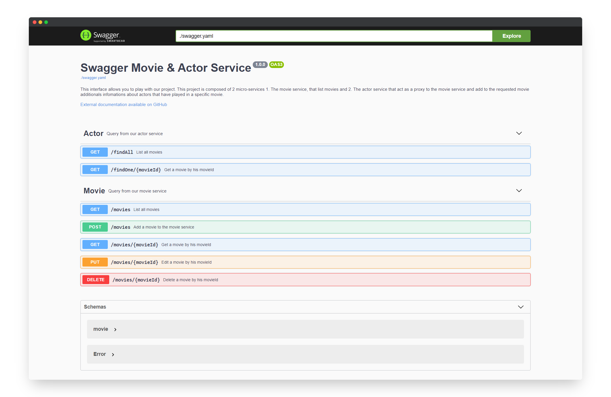
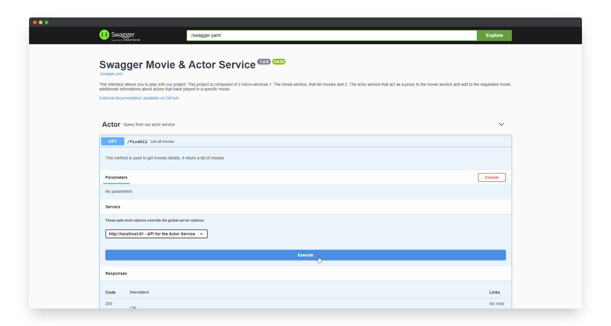
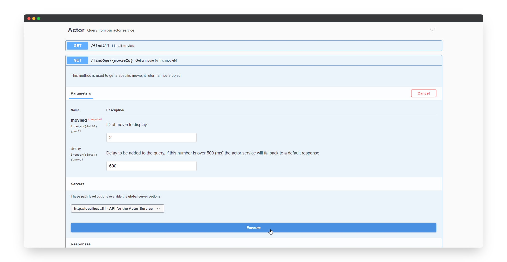

# ST2DCCC
Cloud Integration (M2, M2-APP-LSI, M2-APP-RI, M2-PRO - 2021S9)

## Overview
This repository contains the final project (that includes labs 1 to 3).

Instructions are available in `.pdf` files at the root of the directory.


## Prerequisite
This project runs on docker.

You can check if docker is properly installed and running by typing into a terminal a simple docker command such as `docker ps`:


## Installation
Clone this repository (you can use Git, or use the GUI client GitHub Desktop)

And that's it !

## Run
Now you can run the project. To do so, you will have to open a terminal and execute the following command :

*Optionnal* You can download pre-built images from the GitHub Container Registry using the following command:

```bash
docker pull ghcr.io/iamfrench/efrei-m2-st2dccc_movie
docker pull ghcr.io/iamfrench/efrei-m2-st2dccc_actor
```

Then you can start the application using the following command:

```bash
docker-compose up -d
```

> Hint: To speed up the build process, you can use the following command:

```bash
docker-compose build --parallel
```

This command will read the [`docker-compose.yml`](./docker-compose.yml) file and deploy the application on your local computer.


You can check if the containers are running using this command:

```bash
docker-compose ps
```


## Tests
Now that you have installed, and run the application, it's time to play with the project!

Open you web browser to [`http://localhost`](http://localhost)

The interface that is displayed is the default Swagger UI web Client. This web client has been fed with a definition file ([`swagger.yaml`](./swagger.yaml)) that describe our APIs.



### Available endpoints and methods
Because we have two services running we have chosen to expose them to two different ports as displayed in the solution diagram.
The port `81` is used by the actor service and the port `82` is used by the movie service.

In order to use those endpoints on different ports in Swagger UI we have overwritten the default host (lines `4` and `9`) in the [`docker-compose.yml`](./docker-compose.yml) file:


#### Actor Service (on port 81)

##### `GET` finAll
> Return all movies stored in the movie service with actors

##### `GET` findOne/`{movieId}`
> Return a movie from the movie service, with actors by `movieId`


#### Movie Service (on port 82)

##### `GET` movies
> Return all movies

##### `POST` movies
> Add a new movie to the movie service

##### `GET` movies/`{movieId}`
> Return a single movie by `movieId` 

##### `PUT` movies/`{movieId}`
> Edit a movie by `movieId` 

##### `DELETE` movies/`{movieId}`
> Delete a movie by `movieId` 

### Test the circuit breaker
The circuit breaker is implemented in the actor service. It is used when this service call the movie service.

#### Service is unavailable (no response)
If the requested service is unavailable a fallback method is implemented to prevent a cascade failure.

To create a failure, you just need to kill the container running the movie service. To do so, we will use the Docker Desktop Dashboard, a GUI for Docker:


Now that the container is down, we can test if the circuit breaker is working by executing a REST request to the actor service.

To do so, we will use the Swagger UI:



And here is the response:


As expected, the movie service is unavailable, therefore the fallback method have been called and the response modified accordingly.

Here is the code responsible for that (in the actor service):


#### Service is slow or degraded (timelimit) 
If a request is taking too much time, a fallback method is taking care of providing a response to ensure a continuity of service.

To simulate this delay, we have implemented an argument (passed as a query parameter) for the `GET {movie-service}/movies/{id}` route in the movie service:


And thanks to the Swagger UI we can test this:



This produces the following response:


As expected, a fallback method has been triggered.

Here is the code responsible for that (in the actor service):


The time limit has been set in the circuit breaker config:


## Clean up
Now that you have finished playing with the application. It's time to clean the project.

To do so, open a terminal and type the following command:

```bash
docker-compose down -v
```

This command will stop and remove containers and networks from your computer assigned to our project.


